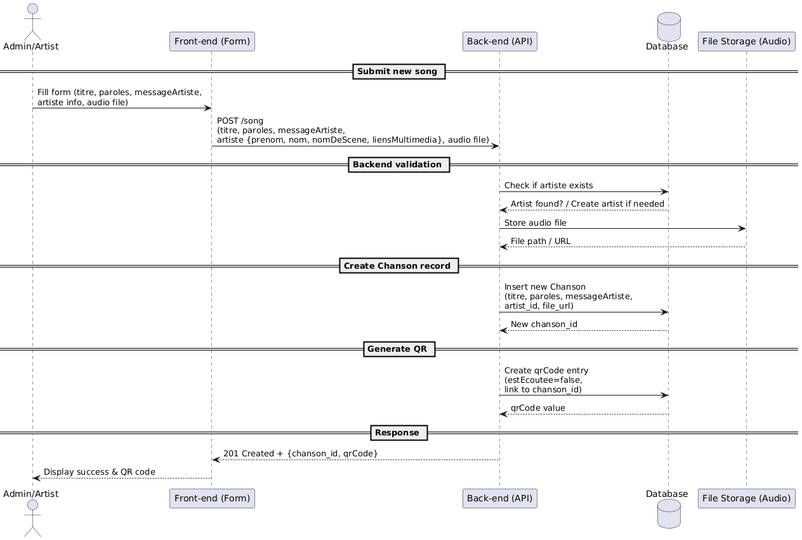
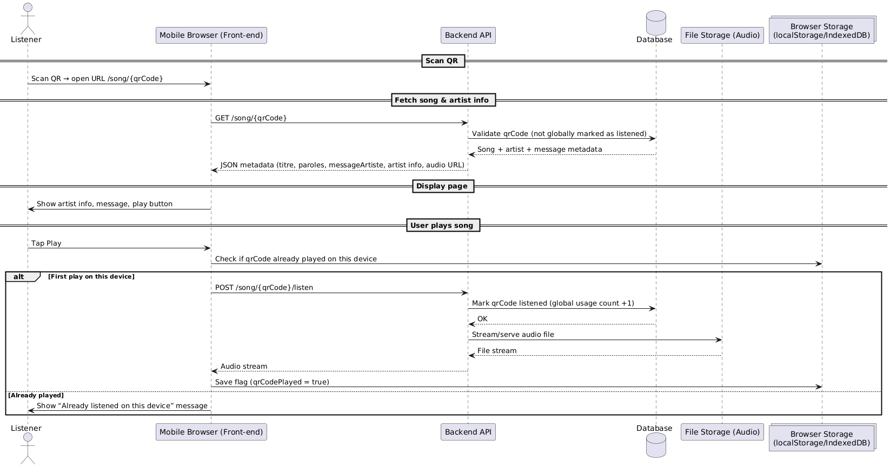

# Impermanent : Atelier de programmation du 28 septembre 2025
Projet web collaboratif explorant les thèmes de l’impermanence dans un contexte
d’abondance numérique.

## Objectif
Développer une application prototype pour un doctorant du nouveau département de
design de l’ÉTS, dans une réflexion sur notre relation à l’art et à la musique
par la technologie.

## Concept
Un CMS minimal qui génère un QR code donnant droit à **une seule écoute** d’une
chanson, avec ses paroles et un message de l’artiste.

- Chaque QR code autorise une écoute par appareil (stockée en local dans le
  navigateur).
- Le même code peut être scanné par plusieurs personnes, mais chaque écoute
  reste unique.

## Contexte théorique
Ce projet s’appuie sur les théories critiques des industries culturelles et sur
la théorie de la résonance du sociologue allemand Hartmut Rosa :
<https://en.wikipedia.org/wiki/Resonance_(sociology)>

## Tâches de l’atelier
- Coder le **front-end** et le **back-end**
- Déployer le tout sur notre infrastructure dans le cluster sandbox:
  (equipe)-impermanent.sandbox.cedille.club

## Documentation: Frontend & Backend

Les éléments qui suivent sont des suggestions.  Libre à vous de procéder
autrement si vous préférez !

### **Architecture**

- Backend

  - API REST (ex. /song pour créer une chanson + QR code).

  - Stockage audio sous forme de fichiers (ex. bucket S3 ou volume persistant)
    référencés en base de données.

  - Endpoints :

    - `POST /song` : création d’une chanson avec ses infos + QR

    - `GET /song/{qrCode}` : récupération des infos sur la chanson + URL audio

    - *`POST /song/{qrCode}/listen` : enregistre la première écoute (optionnel,
      si vous souhaitez tracer les lectures côté serveur).*

- Frontend

  - Page qui s’ouvre au scan du QR code, affiche l’artiste, le message et le
    bouton « Écouter ».
  - Page d'accueil qui permet d'ajouter une chanson et d'afficher un QR code.
  - Vérifie dans localStorage/IndexedDB si l’utilisateur a déjà écouté la
    chanson sur ce navigateur.

- Guides visuels

  - Les vues à implémenter : [View the PDF](docs/impermanent_views.pdf)

  - Modèle de données UML:

    

  - Cas utilisation: Un artiste ajoute une chanson pour créer un QR Code

    

  - Cas utilisation: Une personne souhaite écouter une chanson en scannant un
    code qr.

    

  > Stockez l’URL du backend dans les variables d’environnement pour faciliter
  > le déploiement. (fichier .env)

  > Pour le développement, utilisez des conteneurs Docker (PostgreSQL, etc.)
  > pour vos bases de données.

## Technologies suggérées (si vous n’avez pas de préférence)

- Frontend : [React](https://create-react-app.dev/docs/getting-started/)

- Backend : Node.js (API REST) avec
  [Express](https://expressjs.com/en/starter/installing.html)

- Base de données : PostgreSQL

Pour le développement, vous pouvez lancer une instance PostgreSQL temporaire
avec Docker :

```bash
docker run --name impermanent-dev \
  -e POSTGRES_USER=impermanent-dev \
  -e POSTGRES_PASSWORD=test123 \
  -e POSTGRES_DB=impermanent-dev \
  -p 5432:5432 \
  -v pgdata:/var/lib/postgresql/data \
  -d postgres:16
```

Cela permet de démarrer rapidement une base de données locale sans l’installer
directement sur votre machine.

## Documentation: DevOps

Le dossier k8s-template fournit une base de manifestes Kubernetes (Deployment,
Service, Ingress).  Adaptez les champs nécessaires et posez vos questions si
besoin.

### **CI/CD**

- **CI – Intégration Continue** Intégrer régulièrement du code dans la branche
  principale, exécuter des tests, puis construire et publier l’image Docker sur
  `ghcr.io`.

- **CD – Déploiement Continu** Déployer l’application à partir de l’image
  produite.  Ici, on applique les manifests Kubernetes avec `kubectl`.

> Pour l’atelier, nous n’utilisons **ni ArgoCD ni Flux** : le déploiement se
> fait manuellement.

### **Procedure pour avoir accès au kubectl**

- Installer Krew dans votre terminal: suivre [les instructions d'installation de
krew](https://krew.sigs.k8s.io/docs/user-guide/setup/install/)

- **Kubelogin**

`kubelogin` est utilisé pour s'authentifier au cluster sandbox pour cet atelier.

Pour installer `kubelogin`, exécuter la commande :


```bash
kubectl krew install oidc-login
```

Pour d'autres options d'installation, voir [le repo de
kubelogin](https://github.com/int128/kubelogin)

- Récupérer le fichier de configuration envoyé sur notre [Discord](https://discord.com/channels/773341080254152746/1421884995496317003).

- Modifier dans le fichier k8s-sandbox-config.yaml les deux lignes où vous devez
  mettre votre courriel étudiant de l'ETS <your-email>.

- Indiquer à kubectl où se situe le fichier de configuration.

Avec Linux/MacOS:

```bash
export KUBECONFIG=~/Downloads/k8s-sandbox-config.yaml #Modifier selon l'emplacement du kubeconfig téléchargé
kubectl get nodes
```

Avec Windows:

```bash
kubectl oidc-login
$env:KUBECONFIG="C:\Users\<user>\Downloads\k8s-sandbox-config.yaml" #Modifier selon l'emplacement du kubeconfig téléchargé
kubectl get nodes
```

Vous devriez être redirigé vers une page d'authentification de Omni pour vous
authentifier.  (Si cela ne vous redirige pas vers une page de connexion dans
votre navigateur, vérifier qu'il n'y a pas de fautes de frappe.)

- Dans la page de connexion, cliquer sur Créer un compte Omni.  Saisir le même
courriel et un mot de passe.

- Vérifier votre courriel en cliquant sur le lien reçu par email.

- Ensuite, vous pouvez refaire la commande et vous devriez voir ceci :

```bash
kubectl get nodes

#(objectpath '/org/freedesktop/portal/desktop/request/1_192/t',)
#NAME                                 STATUS   ROLES           AGE    VERSION
#k8s-cedille-sandbox-controlplane-0   Ready    control-plane   3d3h   v1.30.0
#k8s-cedille-sandbox-worker-0                Ready    <none>          3d3h   v1.30.0
#k8s-cedille-sandbox-worker-1                Ready    <none>          3d3h   v1.30.0
#k8s-cedille-sandbox-worker-2                Ready    <none>          3d3h   v1.30.0
```
### **Guide d'utilisation pour Kubectl**

Afin d'intéragir avec un cluster Kubernetes, il faut communiquer avec son
API. Heureusement, un outil est fourni afin de simplifier ces appels: _kubectl_.

Toutes les actions faites sur Kubernetes peuvent être invoquées par cette
commande.

#### Utilisation de base
La structure de cette commande est la suivante:

```bash
kubectl <verb> <resource> <id> (optional)[ -n <namespace>]
```

Les verbes sont des actions que l'on exécute sur Kubernetes, voici quelques
exemples commun que vous pourriez utiliser :

- **get** : affiche une ou plusieurs ressources
- **describe** : affiche les détails de configuration d'une ressource
- **apply** : applique une configuration, prend un fichier ou un objet YAML
- **create** : permet de créer une ressource
- **delete**: efface une ressource
- **logs** : affiche les messages d'un pod
- **port-forward** : transfert la connection d'un pod localement

Les ressources dans Kubernetes représentent des objets avec lesquels vous pouvez
intéragir. Voici quelques types de ressources courantes :

- **pods** : Unité de base qui exécute des conteneurs.
- **services** : Abstraction qui définit un moyen d'accéder aux pods.
- **deployments** : Gestion des révisions et mises à jour des pods.
- **ingress**: Ressource qui gère l'accès externe aux services, souvent via HTTP
  ou HTTPS.
- **configmaps** : Stockage de données de configuration non sensibles.
- **secrets** : Stockage de données sensibles, comme des mots de passe.
- **volumes** : Abstraction pour le stockage persistant.
- **namespaces** : Segmentation des ressources pour l'isolement.
- **replica sets** : Assure un nombre spécifié de répliques de Pods en cours
  d'exécution.

Exemple de déploiement : une requête vient de l’extérieur.
Cette requête est captée par l’ingress selon son URL et acheminée vers le service.
Le service la redirige ensuite vers le pod qui exécute l’application sur le port associé.


On peut obtenir l'``id`` d'une ressource spécifique en affichant la liste de
ressources de ce type, par exemple :

```bash
kubectl get pods

NAME                                   READY   STATUS    RESTARTS   AGE
cnpg-1                                 1/1     Running   0          9h
impermanent-6f954f6554-xztxg           1/1     Running   0          9h
impermanent-backend-76749bdb47-ndl75   1/1     Running   0          9h
```
Puis, avec cet id, on peut aller chercher plus d'informations sur cette ressource :

```bash
kubectl describe pod impermanent-6f954f6554-xztxg
Name:             impermanent-6f954f6554-xztxg
Namespace:        eventichs
Priority:         0
Service Account:  default
Node:             k8s-cedille-sandbox-worker-2/10.10.1.130
Status:           Running
Containers:
  impermanent:
    Image:          ghcr.io/juliengiguere/impermanent-test-web:latest
    Ready:          True
    Limits:
      cpu:     500m
      memory:  128Mi
    Requests:
      cpu:        500m
      memory:     128Mi
Conditions:
  Type                        Status
  PodReadyToStartContainers   True
  Initialized                 True
  Ready                       True
  ContainersReady             True
  PodScheduled                True
Events:                      <none>
```
Finalement, il y a le namespace que l'on peut passer en paramètre à kubectl.
Dans Kubernetes, les namespaces sont une ressource qui permettent d'isoler
les applications et les accès.
Lorsqu'aucun namespace n'est défini
(comme dans les exemples précédents), toutes les commandes s'exécutent
sur le namespace ``default``. On peut spécifier un namespace ainsi :

```bash
kubectl get pods -n cedille
```

Noter qu'il faut que ce namespace soit déjà existant. Si ce n'est pas le cas, on
peut le créer ainsi :

```bash
kubectl create namespace cedille

# et pour l'effacer
kubectl delete namespace cedille
# à noter qu'effacer un namespace efface aussi toutes les ressources contenues dans celui-ci
```

### Utilisation des templates k8s
Des fichiers sont fournis dans le dossier k8s-template, contenant les ressources
nécessaires au déploiemnt de vos applications.

Comme mentionné plus haut, il faut remplacer les champs indiqués afin que les
fichiers de configuration soient valides :
  - Kustomization.yaml : namespace
  - Frontend
	- Deployment.yaml : image
	- Service.yaml : port
	- Ingress.yaml : host (x2)
  - Backend:
	- Deployment.yaml : image
	- Service.yaml : port
	- Ingress.yaml : host (x2)
	- Secret.yaml : [variables pour postgres]

Afin d'éviter les collisions lors des déploiements, assurez vous que le namespace spécifié est unique.

Vous pouvez voir les namespaces créés avec la commande suivante :

```bash
kubectl get namespaces
```

Chaque fichier peut être appliqué manuellement en spécifiant le namespace avec la commande suivante :

```bash
kubectl apply -f <path-to-file.yaml> -n <namespace>
```

Il est aussi possible d'appliquer tous les fichiers en une seule commande à
l'aide de Kustomize, qui est une ressource Kubernetes qui permet de joindre
plusieurs fichiers ensemble et de les appliquer. Cette option cherche
automatiquement les fichiers ```kustomization.yaml```, donc il nme faut que
fournir un dossier contenant ce fichier:

```bash
# Dans le dossier k8s-templates/
kubectl apply -k .
```

Vous pourrez ensuite voir ce qui a été créé ainsi :

```bash
kubectl get all -n <namespace>
```
